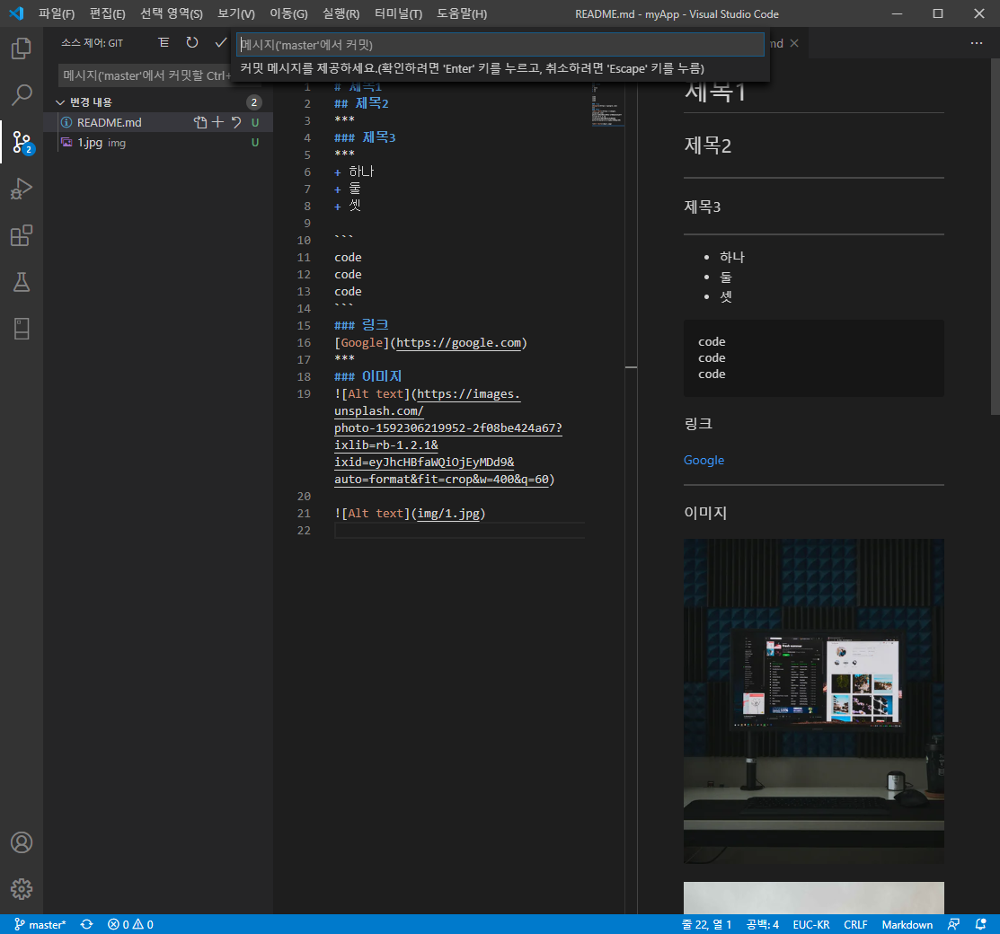
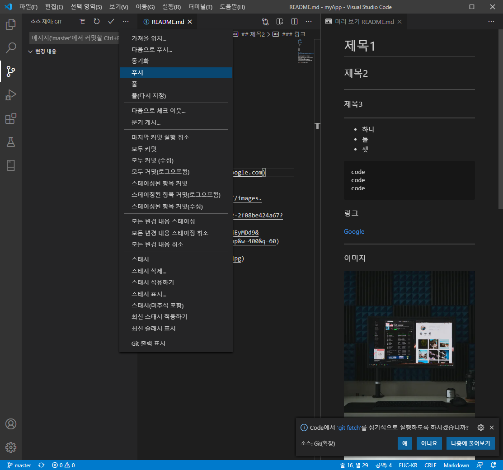

# README로 github에 올린 프로젝트 설명하기

## 마크다운 문서 편집 형식

+ 제목 표시 : #, ##, ###
+ 가로줄: ***
+ 글머리: +
+ 코드: ```로 코드를 감싸주기
```
code
code
code
```
***
+ 링크: [링크명] (링크주소)
+ [Google](https://google.com)
***
+ 인터넷 이미지: ![Alt text] (이미지 주소) 


+ 이미지 파일: ![Alt text] (이미지폴더/이미지이름.확장자)


***
## 비주얼 스튜디오 코드에서 깃허브에 README.md 파일 업로드하기
+ 왼쪽 소스 제어 탭에서 커밋 (체크표시 아이콘) 클릭, 메시지 쓰고 엔터



+ 더보기 탭에서 푸시 클릭



+ 깃허브에 올리는 폴더에 깃허브 주소가 연동되어 있어야 함.
+ 깃허브에 README 파일 확인

